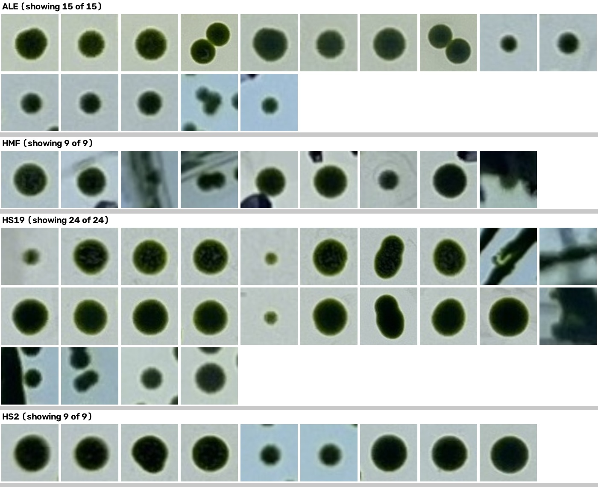
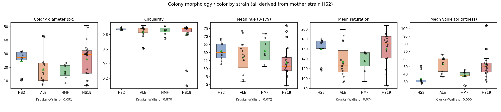
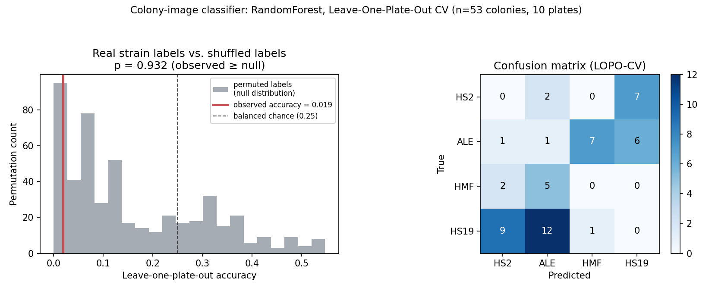
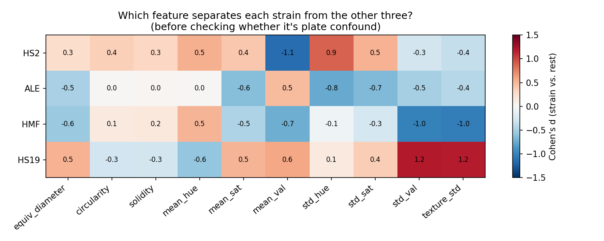
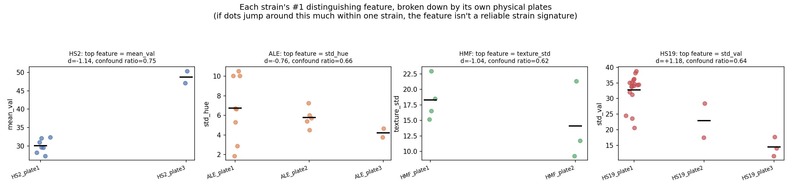

# Chlorella Sister-Strain Colony Classification

**Question:** Given cell-phone photos of streak-isolation plates for four Chlorella
strains (ALE, HMF, HS19, HS2) — all four derived from the same mother strain, **HS2**
— can single colonies be automatically identified on the plate, and can an
image-based model correctly classify which strain a given colony belongs to?

This repo tracks the first phase of that project: turning raw plate photos into a
clean, single-colony image dataset, and an honest first look at whether any
measurable signal separates the strains at all before committing to a CNN.

## Data

- 24 raw plate photos (not included here — unpublished lab photos): 4 strains ×
  3 physical plates × 2 photo angles (front/back of the dish).
- Each plate is a streak-isolation plate: dense streak lines plus a scatter of
  well-separated single colonies in the sparser zones.

## Pipeline (`scripts/segment_colonies.py`)

1. **Locate the dish**: separate the pale blue-gray background from the dish
   interior (HSV threshold), erode inward to avoid rim glare.
2. **Threshold colonies**: saturated green pixels in HSV space (colonies are
   strongly green; agar and background are desaturated).
3. **Connected components** on the green mask → candidate blobs.
4. **Shape filters**: plausible area, high circularity + solidity, bounded
   aspect ratio. This is what rejects handwritten labels and streak fragments
   — pen strokes are elongated or low-solidity, unlike a round colony.
5. **Crop-frame isolation check**: compute the exact crop window for a
   candidate, then reject it if *any other* detected blob (a neighboring
   colony, a streak fragment, or a stray ink mark) falls inside that window.
   This directly enforces "the saved image shows exactly one colony," rather
   than relying on an arbitrary isolation distance.
6. **QC overlays** (`qc_samples/`): every plate photo gets an overlay image
   with green boxes for accepted colonies and red boxes (labeled with the
   rejection reason) for everything discarded, so every automatic call is
   visually auditable.

A handful of remaining false positives (streak fragments, plate-edge shadows)
were caught by eye in the QC overlays and manually removed — see commit
history / `data/colony_manifest.csv`. Example overlay (green = accepted,
red = rejected with reason) — the other three strains' overlays are in
`qc_samples/`:

-1_overlay.jpg>)

**Result: 53 clean single-colony crops** — HS2 (mother strain) = 9, ALE = 15,
HMF = 7, HS19 = 22 — from 24 source photos. Montage of every crop below
(`qc_samples/` has example accept/reject overlays):

## First look: is there any separable signal at all?

Before training any classifier, `scripts/analyze_features.py` and
`scripts/plot_features.py` compute simple, interpretable features per colony
(equivalent diameter, circularity, mean hue/saturation/brightness) and compare
them across strains (Kruskal-Wallis test):

| feature | Kruskal-Wallis p-value |
|---|---|
| colony diameter | 0.091 |
| circularity | 0.870 |
| mean hue | 0.072 |
| mean saturation | 0.074 |
| **mean brightness (V)** | **0.0002** |

### Important caveat — this is very likely a batch/lighting artifact, not biology

The four strains' plates were each photographed in their own session (all 3
plates of one strain shot back-to-back). When brightness is broken down
**within** a single strain, by individual source photo, it varies almost as
much as it does **between** strains:

- HS2's own 3 plates: mean brightness 30.1 / 48.7 / 30.1
- ALE's own 4 plates: mean brightness 60.2 / 58.8 / 40.4 / 63.2

That range (±10-15 units within one strain, from lighting/exposure alone) is
comparable to the between-strain spread that produced the "significant"
p-value above. **A classifier trained on this data could easily learn to
recognize the photo session (lighting/exposure) instead of the strain**, and
would report deceptively high accuracy that would not generalize to a new
photo of the same strain taken on a different day.

## Conclusion so far

With only 3 physical plates per strain, all imaged in one uninterrupted
session per strain, **strain and imaging-batch are confounded** in this
dataset. No result from it — classical features or a CNN — can currently
distinguish "this is really the strain" from "this is really the lighting
that day." This needs to be fixed at the data-collection stage, not the
modeling stage.

## We tried the classifier anyway — here's what happened

Rather than stop at the confound warning, we trained a classifier on the 53
crops to see directly what happens (`scripts/train_classifier.py`,
`scripts/plot_classifier_results.py`). Given n=53, we used interpretable
features (colony size, circularity, solidity, HSV color mean+spread, a
texture measure) rather than a deep CNN — a CNN has far more parameters than
training examples here and would only be more prone to the same failure
mode, not less.

**Evaluation protocol:** Leave-One-Plate-Out cross-validation (LOPO) — the
model is tested only on colonies from a physical plate it never saw during
training (10 plates total across the 4 strains: ALE×3, HMF×2, HS19×3, HS2×2).
This is the minimum bar for a believable result; a random colony-level
train/test split would leak same-plate colonies into both sides and produce
misleadingly high accuracy.

**Result:**

| Model | LOPO accuracy | Permutation-null mean | p-value (observed ≥ null) |
|---|---|---|---|
| Random Forest | **0.019** (1/53 correct) | 0.159 | 0.932 |
| Logistic Regression | 0.019 | 0.167 | 0.912 |

(Balanced chance for 4 classes would be 0.25; the null mean is lower than
that because the plate groups are small and unevenly sized.)

The real-label model did not just fail to beat chance — it scored **worse
than 93% of models trained on randomly shuffled labels**:

**Interpretation:** this is the expected signature of a model overfitting to
per-plate idiosyncrasies (lighting, exposure, agar staining that day) that do
not transfer to a new plate of the same strain — exactly what the earlier
brightness-confound analysis predicted. Tellingly, `mean_val` (brightness)
is the single most "important" feature when the same model is fit on *all*
the data with no held-out plate — i.e., it's the easiest thing to memorize
within a plate, and the least useful thing across plates. **This is a clean
negative result, not an inconclusive one**: with the current photos, there
is no image-based signal that generalizes across plates, for either a
classical-feature model or (by extension) a CNN.

## Is any *pair* of strains separable, even if all four aren't?

The 4-way task failing doesn't rule out two specific strains being
distinguishable. `scripts/pairwise_classifier.py` re-ran the same LOPO
protocol on all 6 strain pairs individually:

| Pair | n (A/B) | LOPO acc | permutation-null mean | p-value |
|---|---|---|---|---|
| HS2 vs ALE | 9/15 | 0.125 | 0.348 | 1.000 |
| HS2 vs HMF | 9/7 | 0.125 | 0.232 | 0.874 |
| HS2 vs HS19 | 9/22 | 0.065 | 0.401 | 0.897 |
| ALE vs HMF | 15/7 | 0.091 | 0.360 | 0.894 |
| ALE vs HS19 | 15/22 | 0.027 | 0.343 | 1.000 |
| HMF vs HS19 | 7/22 | 0.103 | 0.389 | 0.817 |

Every single pair shows the same pattern as the 4-way result: observed
accuracy sits *below* the permutation-null mean in all six cases. There is
no "easy pair" hiding in this dataset — the failure is uniform.

## Does augmentation help?

`scripts/augment_and_train.py` expanded the dataset 10x (rotation, flips,
and — specifically targeting the diagnosed confound — brightness/contrast/
saturation jitter, plus mild noise), keeping every augmented copy tagged to
its original plate so LOPO grouping still prevents leakage. Result:
unchanged.

| Model (10x augmented) | LOPO accuracy | permutation-null mean | p-value |
|---|---|---|---|
| Random Forest | 0.025 | 0.152 | 0.876 |
| Logistic Regression | 0.025 | 0.169 | 0.945 |

Augmentation can add rotation/flip invariance and force the model to not
lean on absolute brightness, but it **cannot manufacture new plates or new
imaging sessions** — and that's what's actually missing. More synthetic
variations of the same 10 plates don't add the between-session diversity
needed to separate "strain" from "which day this was photographed."

## Which feature best explains each strain?

`scripts/explain_strains.py` computes, per strain, a one-vs-rest Cohen's d
for every feature (how far that strain's mean sits from the other three, in
pooled-SD units):

| Strain | Top feature | Cohen's d | 2nd feature | Cohen's d |
|---|---|---|---|---|
| HS2 | mean_val (brightness) | -1.14 | std_hue | +0.88 |
| ALE | std_hue | -0.76 | std_sat | -0.67 |
| HMF | texture_std | -1.04 | std_val | -1.01 |
| HS19 | std_val | +1.18 | texture_std | +1.18 |

Those look like strong effects. But we already showed brightness can look
"significant" purely from lighting differences between photo sessions, so
every feature here gets the same check applied to all 10, not just
brightness: **does between-strain spread exceed within-strain,
between-plate spread?** (ratio computed from plate means; ratio > 1 favors a
real strain effect, ratio ≤ 1 means plate-to-plate noise alone explains as
much or more.)

| Feature | Between-strain SD | Within-strain (between-plate) SD | Ratio |
|---|---|---|---|
| circularity | 0.09 | 0.07 | **1.32** |
| solidity | 0.06 | 0.04 | **1.29** |
| mean_val | 7.66 | 10.24 | 0.75 |
| std_hue | 1.30 | 1.97 | 0.66 |
| std_val | 3.09 | 4.81 | 0.64 |
| texture_std | 2.86 | 4.62 | 0.62 |
| std_sat | 3.52 | 10.54 | 0.33 |
| mean_sat | 7.87 | 22.70 | 0.35 |
| equiv_diameter | 2.25 | 8.53 | 0.26 |
| mean_hue | 0.65 | 9.42 | 0.07 |

**The pattern is telling: every feature that showed up as a strain's "top
distinguishing feature" above (brightness, hue/saturation spread, texture)
has a confound ratio well below 1** — meaning plate-to-plate lighting noise
within one strain is *larger* than the difference between strains. The plot
below shows this directly: e.g. HS2's top feature (brightness) jumps from
~30 to ~49 between its own two plates — a bigger swing than the whole
between-strain spread that produced its striking effect size in the first
place.

The only two features with ratio > 1 — **circularity and solidity**, i.e.
colony shape — make physical sense as the most lighting-robust measurements
(shape doesn't change with exposure), but their effect sizes are small
(0.09–0.35), so they're the most *trustworthy* signal in this dataset and
also the *weakest* one. There is no feature here that is both strong and
trustworthy.

**Bottom line:** nothing in this dataset "explains" a strain in a way that
would hold up on a new plate. The features that look most explanatory are
exactly the ones most contaminated by which day a plate was photographed.

## Numeric dataset

`data/colony_numeric_dataset.csv` / `.xlsx` — every colony crop reduced to
the exact 10-feature vector used for classification above (built by
`scripts/build_xlsx.py`):

`equiv_diameter, circularity, solidity, mean_hue, mean_sat, mean_val, std_hue, std_sat, std_val, texture_std`

The `.xlsx` has three sheets:
- **Colony Data** — all 53 rows, one per colony, tagged with `strain` and
  `plate_group`.
- **Strain Summary** — n / mean / std per feature, grouped by strain,
  computed with live formulas (`SUMPRODUCT`-based, so they recompute if you
  edit `Colony Data`) rather than pasted-in numbers.
- **Plate Summary** — the same, grouped by individual physical plate instead
  of strain — this is the sheet that shows the batch-effect confound
  directly (e.g. compare brightness across HS2's own 2 plates vs. across
  strains).

Note: this sandbox has no LibreOffice available to mechanically recalculate
the workbook, so the formulas weren't verified by opening the file here —
instead the exact same arithmetic (`n`, `Σx`, `Σx²` → mean/sample-std) was
independently checked against `pandas.groupby(...).agg(['mean','std'])` in
Python and matched to ~1e-13. Excel/Google Sheets recalculates all formulas
automatically on open, so this is not expected to require any action, but
worth a glance the first time you open it.

## Recommended next steps

See **[RESHOOT_PROTOCOL.md](RESHOOT_PROTOCOL.md)** for the full plan. In
short:

1. **Interleave strains within every imaging session** (never shoot one
   strain's plates back-to-back) — this is the one change that actually
   breaks the confound; everything else improves data quality on top of it.
2. **Fix the imaging rig**: tripod-mounted phone, locked exposure/white
   balance, a diffuse artificial light box instead of daylight, a color
   reference card + scale ruler in every frame.
3. **More plates per strain** (10-12+, target in the protocol) so a
   train/test split can hold out entire plates per class with enough held-out
   samples to be stable — never split at the colony level.
4. Consider **dilution spread plates** instead of/alongside streak plates —
   far more well-isolated single colonies per physical plate.
5. Only once the new data is in hand does it make sense to train an image
   classifier (the protocol includes a pre-registered evaluation plan reusing
   `scripts/train_classifier.py` as the harness), with a Grad-CAM/confound-ratio
   check to confirm it's attending to colony morphology and not artifacts.

## Repo contents

- `scripts/` — the full processing pipeline (segmentation, feature
  extraction, plotting, QC contact sheets).
- `data/colony_manifest.csv` — every accepted colony crop with its source
  photo, bounding box, and shape metrics.
- `data/colony_features.csv` — per-colony size/color features used in the
  analysis above.
- `data/cropped_colonies/` — the 53 single-colony crops, by strain.
- `figures/` — the contact sheet, strain comparison figure, and the
  classifier LOPO-CV / permutation-test results.
- `qc_samples/` — example QC overlays (one per strain) showing accepted vs.
  rejected candidates.
